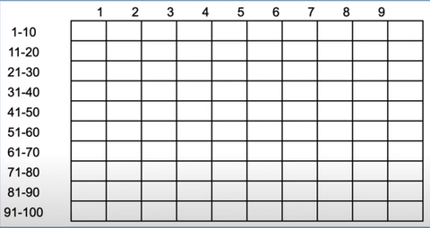
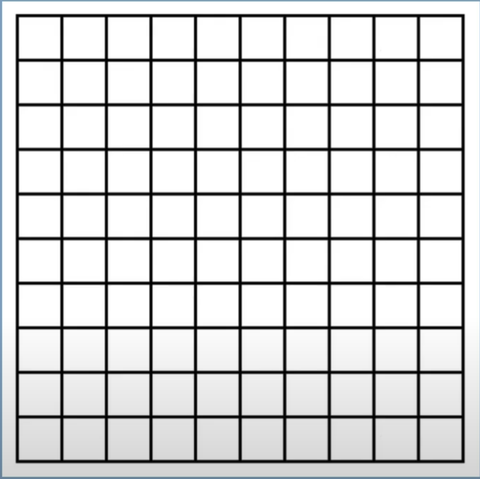

Created: 2025.02.34  
Modified: 2025.02.24  

# Segmentacja czasu

Z tej lekcji dowiesz się:

1. Jakie są 4 główne zasoby i jak się ze sobą łączą
1. Co czyni czas wyjątkowym zasobem
1. Kim są miliarderzy i milionerzy czasu
1. Jak podzielić dzień pracy na 100 części
1. Na co wydajesz swoje tysiąc minut dziennie?
1. Jakie są mity dotyczące rutyn, czyli czego nie da się zrobić w praktyce
1. Wieczorna i poranna metodyka pracy, czyli co zrobić, gdy masz za mało czasu
1. Zasada 3x3 godziny dziennie
1. Zasada 3x100 dni w roku
1. Po co planować 100 dni zamiast od razu cały rok
1. Dlaczego warto zostawić sobie bufor na 65 dni

---
- Czas jest naszym najważniejszym zasobem!
- Zasoby które dysponujemy są zależne od naszego wieku, np:
	+ energia i zdrowie
	+ finanse
	+ czas
	
te trzy zasoby tworzą nasze **możliwośći**.

 - Czasu nie da się maganyzować!!!
 - **Bardzo łatwo jest stracić czas**!!! Czasu trzeaba bardzo mocno pilnować aby go nie zmarnotrawić.
 - Często widzimy tylko dolną połowę klepsydry. Zatem widzimy tylko tą część ile czasu nam już upłynęło, a nie widzimy tego co nam zostało.
 - Zatem bardzo ważne jest abiy wiedzieć ile mamy czasu do dyspozycji. 
 
<!--- --->

Poniżej jest w przyblizeniu czask który mamy do dyspozycji każdego dnia, zatem w zależności ile godzin śpimy, zazwyczaj mamy do dyspozyji 16-17 godzin.

<!------>

 - Nie uda nam się wykorzystać każdej minuty!
 - Można zbudować idealny dzień, ale trudno jest go często powtarzać.
 

### Jak znaleźć czas, którego nie ma?

